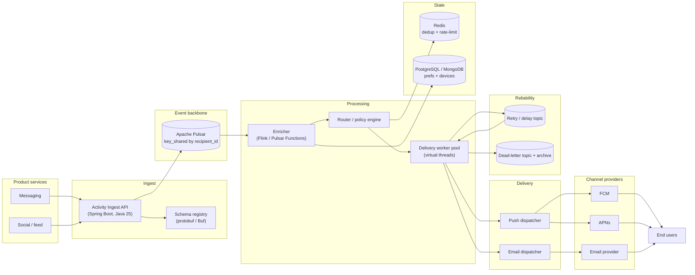

# notification-flow

High-throughput, low-latency **notification platform** that turns product activity events (message sent, post liked, comment created, …) into push/email notifications with **per-recipient ordering**, **idempotent de-duplication**, **retry with backoff**, and **dead-letter** handling.

- **Backbone:** Apache Pulsar (`key_shared` per `recipient_id`)
- **Runtime:** Java 25, Spring Boot, Gradle Kotlin DSL monorepo
- **Contracts:** Protobuf (`notification-contracts`) — `ActivityEvent`, `NotificationDispatch`
- **Modules:** `ingest-api` (Phase 1), `notification-router` (Phase 2 + 3: registry + dedup + enrichment & routing), **`delivery-worker` (Phase 4 + 5: channel delivery + retry/DLQ/replay)**
- **State:** PostgreSQL (recipient prefs/devices, Flyway-managed) + Redis (`SET NX` + TTL dedup, feature flag stubs)
- **Architecture & roadmap:** [`docs/sds.md`](docs/sds.md), [`docs/execution-plan.md`](docs/execution-plan.md)
- **Service docs:** [`notification-ingest/README.md`](notification-ingest/README.md)

## System design

