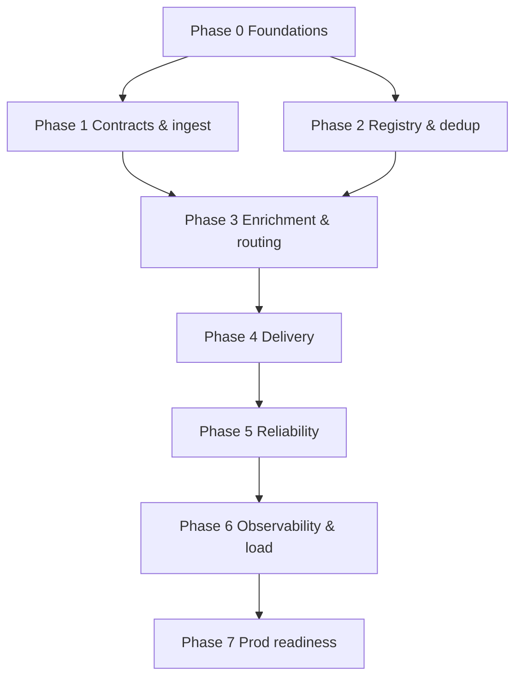
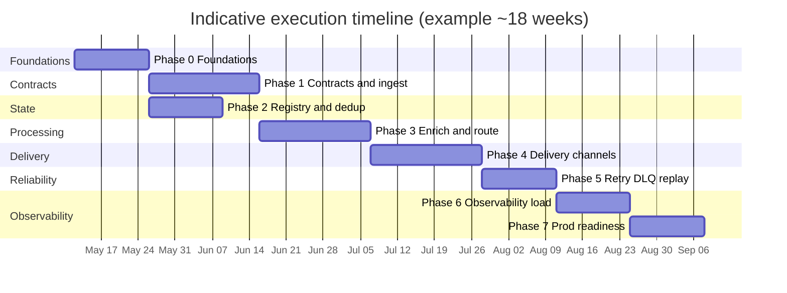

# Execution plan

**Companion to:** [Software Design Specification (SDS)](sds.md)

This document is an **indicative rollout plan** aligned with the SDS services ([§8](sds.md#8-services-and-tech-stack)), deployment view ([§9](sds.md#9-deployment-view-example-on-kubernetes)), and non-functional targets ([§10](sds.md#10-non-functional-targets-initial)). Durations assume one integrated team; **Foundation**, **Ingest**, and **State** can overlap once ownership is clear.

## Principles

1. **Vertical slice first:** Prove **produce → Pulsar → consume → metric** before optimizing throughput.
2. **Contract-led:** Lock **protobuf** (or chosen) schemas and **OpenAPI** for ingest before wiring Flink complexity.
3. **Idempotency early:** **Redis dedup** + message keys appear in the first end-to-end path so R2–R4 are testable from day one.
4. **Managed vs self-hosted:** Prefer **managed Pulsar** (or vendor Kubernetes operator) for Phase 0–2 unless platform mandates self-managed BookKeeper.

## Phases, deliverables, and exit criteria

| Phase | Goal | Key deliverables | Exit criteria |
|-------|------|------------------|---------------|
| **0 — Foundations** | Runnable platform skeleton | **Java 25** repo layout (Spring Boot or Quarkus); **Kubernetes** namespaces; **Apache Pulsar** (dev/stage); **Prometheus/Grafana** or cloud metrics baseline; CI pipeline (build, test, container image) | Health-checked **Pulsar** cluster; sample producer/consumer **Java** job proves connectivity and **`key_shared`** ordering in a test topic |
| **1 — Contracts & ingest** | Stable event contract and ingress | **Protobuf** definitions + CI validation (**Buf**); **Activity Ingest API** with authn between services; publish to **`activity.events`** (names illustrative); **OpenAPI** published | Synthetic load: ingest meets SDS [§10](sds.md#10-non-functional-targets-initial) p99 ingest→bus target in staging; schema evolution policy documented |
| **2 — Registry & dedup** | R3 testable | **PostgreSQL or MongoDB** for prefs/devices (minimal schema); **Redis Cluster** (or single node dev) with **SET NX + TTL** dedup; router reads prefs before dispatch | Integration tests: **duplicate** produce attempts yield **single** downstream notification intent |
| **3 — Enrichment & routing** | R1 path through orchestration | **Flink + Pulsar** job (or **Pulsar Functions** MVP) resolves recipient/devices; **router** applies static rules; outputs to **`notification.dispatch`** topic; **feature flags** stub (Redis) | End-to-end: activity event → enriched dispatch message on topic with correct **recipient key** ordering under **`key_shared`** |
| **4 — Delivery** | User-visible notifications | **Delivery workers** (virtual threads); **FCM** + **APNs** sandbox + one **email** provider; secrets via cluster secret store | Successful delivery to real sandbox devices/email in staging; basic **retry** on transient HTTP failures |
| **5 — Reliability hardening** | R2 fully satisfied | Dedicated **retry** Pulsar topic(s) + policy; **DLQ** topic; replay procedure (script or admin API); optional **S3/Blob** archive for DLQ payloads | Chaos or fault injection: failed provider → retries → DLQ without duplicate user-visible sends (dedup holds) |
| **6 — Observability & load** | Operate at scale | **OpenTelemetry** traces across ingest → Flink → workers; dashboards for lag, DLQ rate, dedup suppressions; load/soak test plan | SLO dashboards green under target QPS; runbook for replay and partition hot spots |
| **7 — Production readiness** | Go-live | HA review for Pulsar/Redis/DB; backup/restore drill; SDS [§11](sds.md#11-open-decisions) decisions resolved or explicitly deferred with mitigations; on-call rotation | Production checklist signed off; phased rollout (canary tenants/users) |

## Dependency sketch (Mermaid)

## Indicative timeline (Mermaid Gantt)

Schedule is **illustrative**—adjust bars after sizing Phase 0 infrastructure.

**Note:** Phase 3 needs **both** Phase 1 and Phase 2 finished. In this example **Phase 1** (21d) is longer than **Phase 2** (14d) from the same start—so **`after p1`** is sufficient. If Phase 2 slips past Phase 1, gate Phase 3 on the later of the two.

## Risk-focused ordering

- **BookKeeper / Pulsar ops:** If team **skills** gap is high, complete Phase 0 with **vendor-managed Pulsar** before deep Flink coding.
- **Ordering bugs:** Validate **`key_shared`** with concurrent producers in Phase 3 stress tests before widening rollout.
- **Provider quotas:** Register **FCM/APNs** rate limits in Phase 4 so Phase 6 load tests use realistic backpressure.
