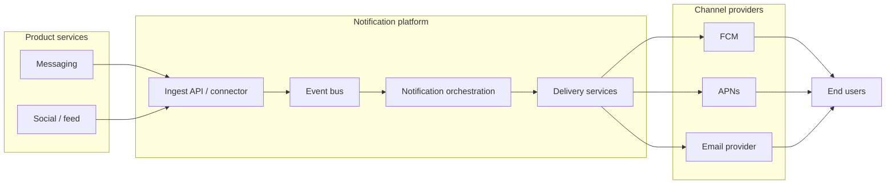
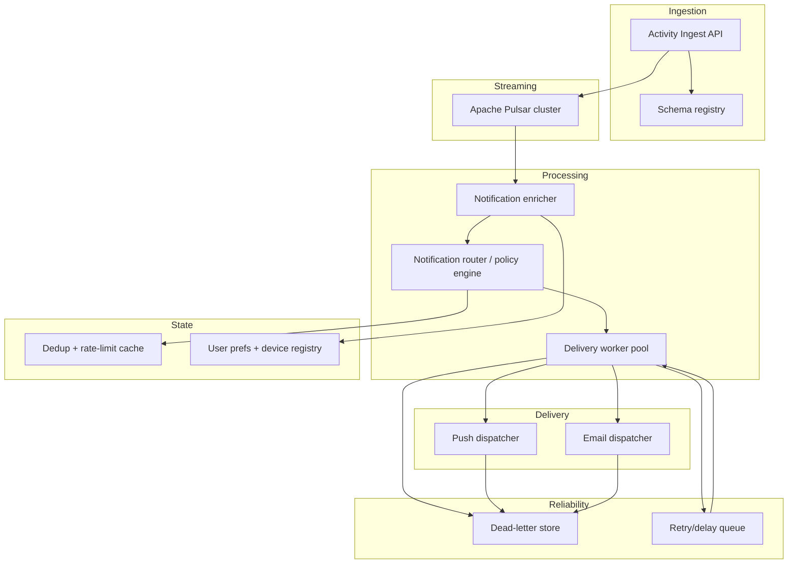
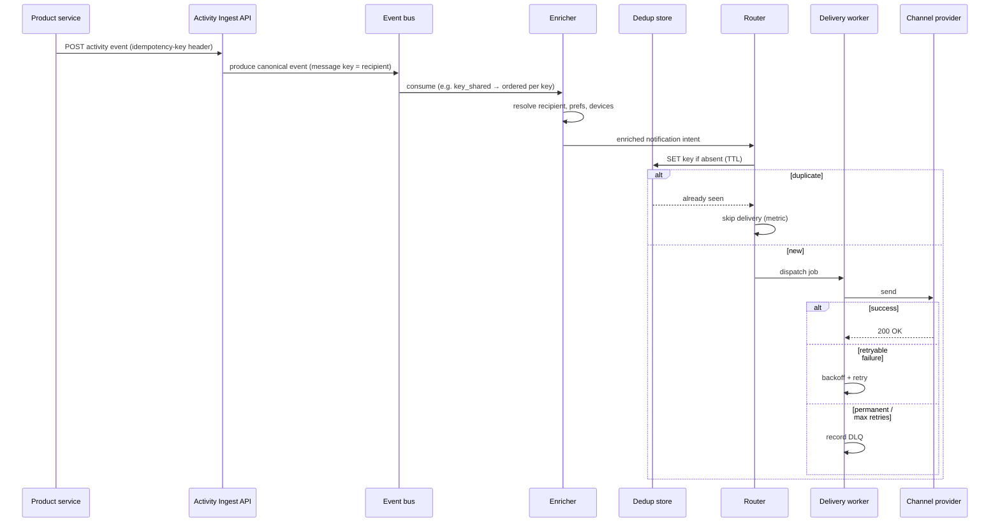
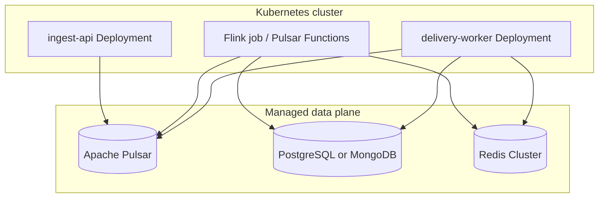

# Software Design Specification (SDS)

## Meta-Scale Real-Time Notification System

| Document | Value |
|----------|--------|
| Version | 0.1 |
| Status | Draft |

---

## 1. Purpose and scope

This SDS defines the architecture for a **high-throughput, low-latency notification platform** that reacts to product events (e.g. message sent, post liked, comment created) and delivers notifications to end users through device push, email, or other channels.

**In scope:** ingestion of activity events, durable buffering, **ordering guarantees** where defined, **de-duplication**, **retry** with backoff, delivery to channel providers, observability, and failure handling (including dead-letter paths).

**Out of scope (initially):** full legal/compliance archive of every payload (can be added via sink to object storage); in-app notification UI components (assumed client-owned).

---

## 2. Requirements summary

| ID | Requirement | SDS approach |
|----|-------------|----------------|
| R1 | Events from user actions (message, like, comment, …) trigger notifications | Activity → canonical **domain events** → **notification pipeline** (§4) |
| R2 | **Retry** on transient failures | **Outbox / consumer retry** with exponential backoff; capped attempts; **DLQ** (§5.3, §6) |
| R3 | **De-duplication** | **Idempotency key** per logical notification; **dedup store** with TTL (§5.2) |
| R4 | **Ordering guarantee** | **Partition key** = `(recipient_id)` or `(recipient_id, notification_type)` for **per-user** ordering; document no global cross-user order (§5.1) |

---

## 3. Design principles

1. **Event log as spine:** All activity is published to **durable topics** (Pulsar + BookKeeper) so consumers can scale horizontally and replay.
2. **At-least-once end-to-end:** Processors are idempotent; sinks use idempotency keys to achieve **effectively-once delivery** of user-visible notifications.
3. **Explicit ordering scope:** Ordering is **per recipient key** (e.g. Pulsar **`key_shared`**) or **per partition** when using compatible clients—not global total order across all users.

### 3.1 Event backbone: Apache Pulsar (chosen) vs Apache Kafka

| Dimension | **Apache Pulsar** | **Apache Kafka** |
|-----------|-------------------|------------------|
| **Mental model** | Topics backed by **Apache BookKeeper**; **subscriptions** (exclusive, shared, **key_shared**, failover); broker is mostly IO/lightweight | Partitioned broker-local logs; **consumer groups** and offset commits |
| **Ecosystem fit (this SDS)** | **Pulsar Java client** for producers/consumers; **Apache Flink** **Pulsar source/sink** for stateful enrichment; **Pulsar Functions** for lightweight transforms | **Kafka Streams** and **ksqlDB** are **Kafka-only**; Flink’s Kafka connector is ubiquitous |
| **Ordering** | **key_shared** subscriptions preserve order **per key** (maps cleanly to `recipient_id`) | Strong **per-partition** order; scale via partition count + key |
| **Retention & tiering** | **Tiered storage** and long retention are a **first-class** pattern (offload to object storage) | **Tiered storage** available; operational model differs by vendor |
| **Geo / multi-region** | **Geo-replication** between clusters is a common **product-level** capability | **MirrorMaker 2**, cluster linking, vendor replication—mature but distinct ops |
| **Ops & staffing** | **Brokers + BookKeeper** (+ metadata service depending on release); more components than a minimal Kafka broker set | Larger talent pool and managed catalog (**MSK**, **Confluent**, **Aiven**) |
| **Interoperability** | Optional **Kafka-on-Pulsar** protocol handler so existing Kafka producers can publish without rewrite | **Native** for Kafka tooling |

**Decision for this system:** Use **Apache Pulsar** as the streaming backbone.

**Rationale:** Pulsar’s **key_shared** consumption matches **per-recipient ordering**, **subscription flexibility** helps fan-out (enrichment, routing, delivery) without duplicating data paths, and **BookKeeper + tiered storage** supports **long retention / replay** as traffic grows. Retry and DLQ are modeled as **dedicated Pulsar topics** with the same durability guarantees.

**Implementation implications:** Do **not** standardize on **Kafka Streams** (not Pulsar-native). Prefer **Flink + Pulsar connector** for stateful joins/windowing, **Pulsar Functions** or **Java consumers** for simpler stages, and the **Pulsar Java client** from the ingest API unless you intentionally front **Kafka protocol** compatibility.

**When Kafka would be preferable:** The organization standardizes on **Kafka Streams / ksqlDB**, wants the **smallest** self-managed footprint, or managed **Kafka-only** contracts are already in place—then Kafka remains a valid alternative; revisit if geo-replication or unified queueing becomes painful.

---

## 4. System context

High-level actors and external systems.

---

## 5. Logical architecture and behavior

### 5.1 Ordering guarantee

- **Guarantee:** For each **recipient**, delivery attempts for notifications derived from the same **keyed** stream are **processed in subscription order** for that key (e.g. **Pulsar `key_shared`** delivers messages for a given key to a single consumer in order).
- **Mechanism:** Producers set the message **key** to **`recipient_id`** (or `shard(recipient_id)` if hot keys are an issue). Consumers preserve order using **Pulsar `key_shared`** subscriptions (per-key ordering), or **Flink** keyed streams fed from Pulsar; Kafka-style **per-partition** ordering applies only if using a Kafka-protocol client with fixed partitioning.
- **Not guaranteed:** Total order across all users; order of unrelated event types unless they share the same keying strategy.

### 5.2 De-duplication

- **Logical key:** `idempotency_key = hash(app_id, recipient_id, event_type, canonical_entity_id, dedup_window)` (example—tune to product rules).
- **Store:** First-class **dedup store** (fast KV) with **TTL** aligned to business window (e.g. 24–48h). On duplicate: **acknowledge and skip** delivery (or emit metric `notification.duplicate_suppressed`).

### 5.3 Retry and dead letters

- Transient errors (5xx from provider, rate limit): **retry** with **exponential backoff + jitter**, max attempts per policy.
- After max attempts: record to **dead-letter topic/queue** with **original payload + error context** for manual replay or tooling.
- **Poison messages:** Skipped to DLQ after validation failure (schema, unknown user).

---

## 6. Component diagram (internal services)

---

## 7. Notification lifecycle (sequence)

---

## 8. Services and tech stack

Each row is a **deployable service or infrastructure component** with a **recommended tech stack**. Alternatives are noted where common.

| Service / component | Responsibility | Tech stack |
|---------------------|----------------|------------|
| **Activity Ingest API** | Authenticate internal callers; validate payloads against schemas; assign message key; produce to bus | **Java 25** — **Spring Boot** or **Quarkus**; **OpenAPI**; **protobuf**; **Pulsar Java client** (or **Kafka protocol** into Pulsar via **Kafka-on-Pulsar / KoP** if required) |
| **Schema registry** | Version event contracts; compatibility checks | **Buf / protobuf** (CI); **Apicurio Registry**; or **Confluent Schema Registry** if using **KoP** and Avro wire format |
| **Event bus (streaming backbone)** | Durable topics; horizontal scale; replay; optional geo-replication | **Apache Pulsar** (selected — see §3.1); **Apache BookKeeper**; managed (**StreamNative Cloud**, **DataStax Luna Streaming**, others) or self-hosted |
| **Notification enricher** | Join activity with user profile, devices, quiet hours, locale | **Apache Flink** (**Java 25**) with **Pulsar connector**; **Pulsar Functions** for lighter stateless transforms; avoid **Kafka Streams** (not Pulsar-native) |
| **Router / policy engine** | Apply fan-out rules, feature flags, A/B; emit dispatch jobs | **Flink** or **Pulsar Functions** / **Java 25 microservices** (Spring Boot / Quarkus) consuming Pulsar; **Redis** for feature flags |
| **Dedup + rate-limit cache** | Idempotency keys; per-user send budgets | **Redis** (Cluster) with **TTL**; optional **Redis Bloom** for probabilistic pre-filter |
| **User prefs + device registry** | Preferred channels, tokens, timezone | **PostgreSQL** or **MongoDB** (aligns with existing `nepleaks-mongo` direction); cache fronted by **Redis** |
| **Delivery worker pool** | Pull jobs; call FCM/APNs/email; handle retries | **Java 25** — **virtual threads** (`java.util.concurrent`); **Spring Boot** or plain **`java.net.http`** clients; orchestration **Kubernetes** |
| **Push dispatcher** | Isolate push-specific auth and batching | Same worker stack; **Google FCM HTTP v1**, **Apple APNs HTTP/2** |
| **Email dispatcher** | Template render + SMTP/API | **SendGrid / SES / Postmark** SDK; templates in **Handlebars** or provider-native |
| **Retry / delay queue** | Backoff scheduling without blocking workers | **Pulsar** topics (e.g. retry with scheduled redelivery patterns, or delay via separate topic + consumer timing); **Temporal** if workflow-style orchestration is required |
| **Dead-letter store** | Audit and replay failed deliveries | **Pulsar DLQ topic** + **S3/Blob** archive for long retention; UI via internal admin |
| **Observability** | Metrics, traces, logs | **OpenTelemetry** Java agent + SDK; **Prometheus** + **Grafana**; **structured logging** (JSON) |

> **Implementation baseline:** All application services in this SDS target **Java 25** on the JVM. The repository’s `nepleaks-engine` historically used **Apache Storm** and **Kafka**; new work standardizes on **Apache Pulsar** (§3.1) with **Flink + Pulsar** (or **Pulsar Functions**) for stream processing—**not** Kafka Streams unless the bus is changed to Kafka.

---

## 9. Deployment view (example on Kubernetes)

---

## 10. Non-functional targets (initial)

| Area | Target |
|------|--------|
| Latency (p99 ingest → bus) | &lt; 100 ms under normal load |
| Durability | Event bus retention ≥ 7 days; DLQ until reconciled |
| Availability | 99.9% API + bus (region-dependent) |

---

## 11. Open decisions

1. **Partition key:** Strict `recipient_id` vs bucketed shards to avoid hot keys for celebrities.
2. **Exactly-once vs effective-once:** Whether to adopt transactional outbox from product DB into **Pulsar** for strongest coupling with source writes.
3. **Multi-region:** Active-active vs primary-secondary for registry and dedup (requires global Redis or CRDT-friendly design). Leverage **Pulsar geo-replication** where appropriate; if the org mandates managed **Kafka-only**, revisit **§3.1**.

---

## 12. Execution plan

Phased rollout (principles, deliverables, Mermaid diagrams, risks) lives in **[execution-plan.md](execution-plan.md)**.

---

## 13. Traceability

| SDS section | Requirement |
|-------------|-------------|
| §3.1 | Backbone choice (supports R1 throughput / replay) |
| §5.1 | R4 ordering |
| §5.2 | R3 de-duplication |
| §5.3 | R2 retry |
| §4–§7 | R1 meta-scale event-driven notifications |
| [execution-plan.md](execution-plan.md) | Phased implementation / delivery sequencing |
